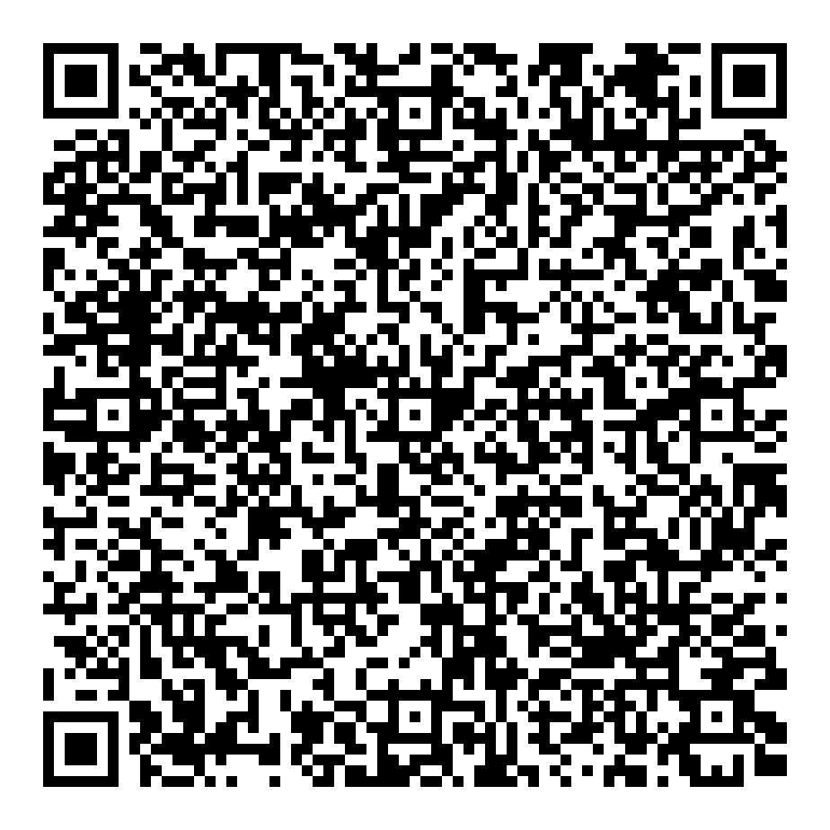

# SimpleCamera 자동전송 ADD-ON

Simple Cam으로 촬영한 새 사진만 골라 기존 SimpleCamera 업무사진 수신기로 자동 전송하는 iOS 보조 앱입니다.

[SideStore에서 설치하기](sidestore://install?url=https%3A%2F%2Fgithub.com%2Fhejong2-byte%2Fsimplecamera-auto-sender-ios%2Freleases%2Flatest%2Fdownload%2FSimpleCameraAutoSender.ipa)

## 동작 방식

- Simple Cam이 원본 사진에 기록한 `Software` 메타데이터를 확인합니다.
- `Simple Camera`로 확인된 새 사진만 전송합니다.
- 사진 수 제한은 없으며, 성공한 사진은 다시 보내지 않습니다.
- 실패한 사진은 앱에서 재시도할 수 있습니다.
- 인증값은 아이폰 Keychain에만 저장되고 저장소·IPA·QR에는 포함되지 않습니다.

## 설치 후 한 번만 설정

자세한 순서는 [설치 및 자동화 설정 안내](docs/install.md)를 따르세요. SideStore 설치 앱은 SideStore의 일반적인 7일 갱신 대상입니다.

## 중요 제약

iOS는 일반 앱의 상시 백그라운드 실행을 허용하지 않습니다. 따라서 단축어의 개인용 자동화에서 `Simple Cam이 닫힐 때` 이 앱의 `새 SimpleCamera 사진 전송` 동작을 즉시 실행하도록 한 번 연결합니다. 사진 검색·선택·반복 단축키는 필요 없습니다.
